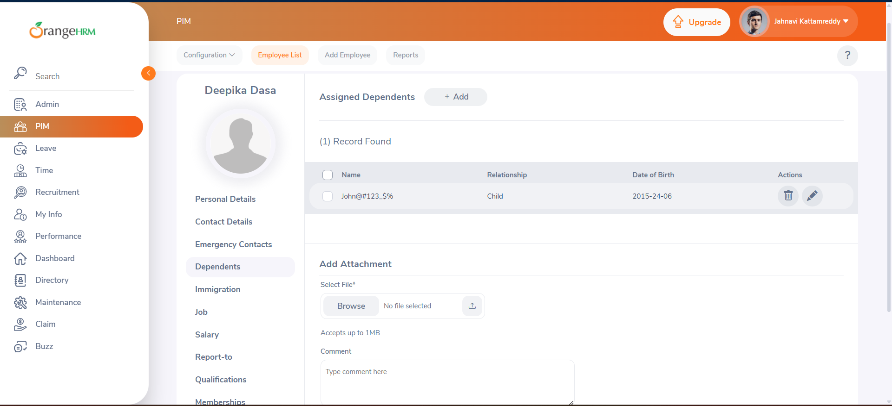
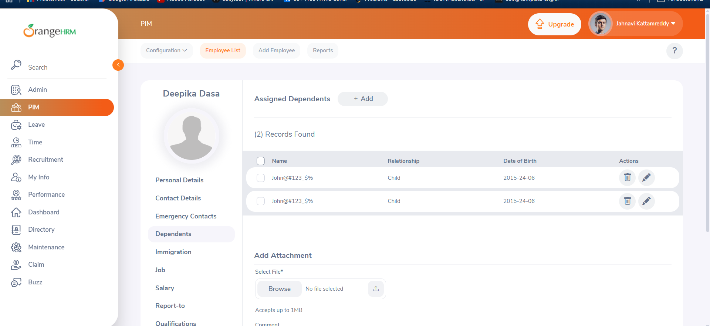
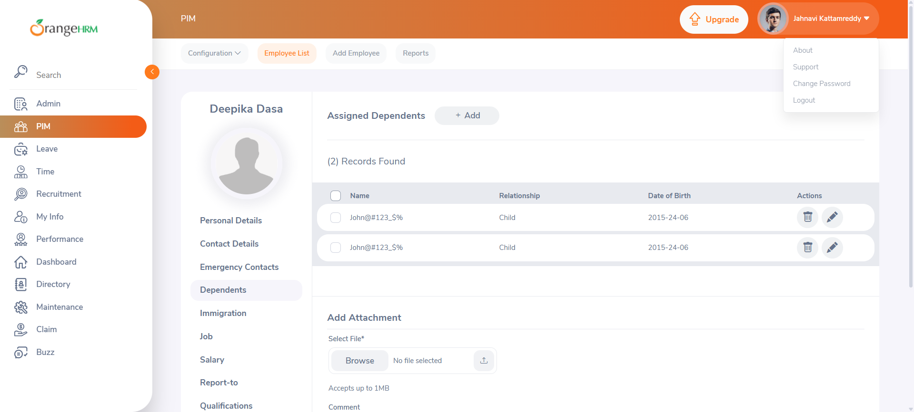

# OrangeHRM Bug Reports

Detailed logs of the defects identified during the testing cycle.

---

##  Bug Report 1: Special Characters Allowed in Dependents Name

*   **Bug ID:** OHRM_BUG_001
*   **Bug Title:** [PIM - Dependents] System allows saving dependent names containing numbers and special characters without validation
*   **Environment:** Chrome Version 148.0.7778.168, Windows 11
*   **Severity:** Medium | **Priority:** Medium

### Steps to Reproduce:
1.  Log in to OrangeHRM as Admin.
2.  Navigate to **PIM -> Employee List** and open any employee's profile.
3.  Click on the **Dependents** tab on the left sub-menu.
4.  Click the **+ Add** button under "Assigned Dependents".
5.  In the "Name" field, enter a value containing special characters: `John@#123_$%`.
6.  Select a Relationship (e.g., "Child") and click **Save**.

### Expected Result:
The system should reject the entry, highlight the field in red, and show a validation error (e.g., *"Name can only contain alphabetical characters"*).

### Actual Result:
The system successfully saves the record and displays the name `John@#123_$%` in the grid.

### Visual Attachment:

---

##  Bug Report 2: Duplicate Dependent Entries Allowed

*   **Bug ID:** OHRM_BUG_002
*   **Bug Title:** [PIM - Dependents] System allows creating duplicate identical dependent records under the same employee profile
*   **Environment:** Chrome Version 148.0.7778.168, Windows 11
*   **Severity:** Major | **Priority:** Medium

### Steps to Reproduce:
1.  Log in to OrangeHRM as Admin.
2.  Navigate to **PIM -> Employee List** and click on any employee's profile.
3.  Click on the **Dependents** tab on the left sub-menu.
4.  Click the **+ Add** button and save a dependent (e.g., Name: `John@#123_$%`, Relationship: `Child`).
5.  Click the **+ Add** button a second time.
6.  Enter the exact same details (Name: `John@#123_$%`, Relationship: `Child`) and click **Save**.

### Expected Result:
The system should check for duplicates and prevent the second record from saving, showing an error (e.g., *"Dependent already exists"*).

### Actual Result:
The system successfully saves the duplicate record, creating identical redundant rows in the grid.

### Visual Attachment:

---

## Bug Report 3: Profile Dropdown Fails to Collapse

*   **Bug ID:** OHRM_BUG_003
*   **Bug Title:** [Navigation Bar] Profile dropdown menu fails to collapse upon second click
*   **Environment:** Chrome Version 148.0.7778.168, Windows 11
*   **Severity:** Minor | **Priority:** Medium

### Steps to Reproduce:
1.  Log in to OrangeHRM as Admin.
2.  Locate the user profile dropdown icon in the top-right corner of the navigation bar.
3.  Click the profile dropdown once to expand it.
4.  Click the same profile dropdown icon a second time to close it.

### Expected Result:
The profile dropdown menu should collapse (close) upon the second click.

### Actual Result:
The dropdown menu remains expanded and does not collapse on the second click.

### Visual Attachment:

