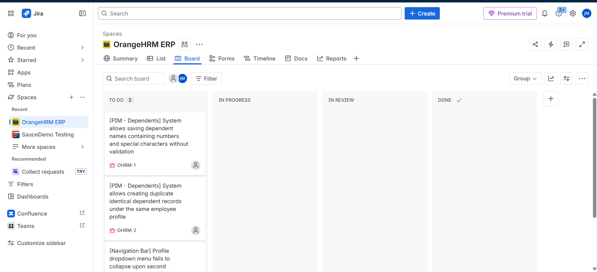

# OrangeHRM ERP Web Testing & API Data Generation Suite

This repository contains an end-to-end testing suite executed against the OrangeHRM Enterprise Resource Planning (ERP) application. 

This project showcases a hybrid testing approach: combining manual UI testing, **Jira Agile defect tracking**, and **Postman API mock-data generation** to drive robust test coverage.

---

## 🗺️ Project Navigation
Explore the individual testing modules of this project below:
*   [**High-Level Test Scenarios**](./OrangeHRM_Test_Scenarios.md): The 20 "What to Test" scenarios mapped from the system requirements.
*   [**Detailed Test Cases**](./OrangeHRM_Test_Cases.md): 32 step-by-step manual test cases covering PIM and Admin modules.
*   [**Defect Logs & Bug Reports**](./OrangeHRM_Bug_Reports.md): Detailed logs of the 3 functional and UI bugs discovered with steps to reproduce.
*   [**API Mock Data Generator Folder**](./OrangeHRM-API-Data-Generator/): Postman collection used to dynamically generate random employee profiles to feed the manual test scripts.

---

## 💡 Key SQA Innovation: API-Driven Data Generation
To avoid manual testing bottlenecks and typing static data, I integrated a Postman mock data collection. 

Using this collection, I dynamically retrieve randomized employee credentials (First Name, Last Name, Email) and store them in the Postman Environment (`OrangeHRM QA.postman_environment.json`) as runtime variables (`emp_first_name`, `emp_last_name`, `emp_email`). I then utilize these values to feed my manual registration and verification tests in the OrangeHRM UI.

---

## 📊 Test Execution Summary & Metrics

*   **Total Test Cases Planned:** 32
*   **Total Test Cases Executed:** 32
*   **Passed Test Cases:** 29
*   **Failed Test Cases:** 3
*   **Blocker/Critical Test Cases:** 0
*   **Pass Rate:** ~90.6%
*   **Fail Rate:** ~9.4%

---

## 🛠️ Jira Defect Management
I tracked the identified bugs inside **Jira** (Project: `OrangeHRM ERP`) to simulate professional Agile workflows.

### Project Kanban Board
*(Insert your Jira Kanban Board screenshot here)*

### Logged Defects:
1.  **[OHRM-1] [PIM - Dependents]** System allows saving dependent names containing numbers and special characters without validation. (Severity: Medium)
2.  **[OHRM-2] [PIM - Dependents]** System allows creating duplicate identical dependent records under the same employee profile. (Severity: Major)
3.  **[OHRM-3] [Navigation Bar]** Profile dropdown menu fails to collapse upon second click. (Severity: Minor)
